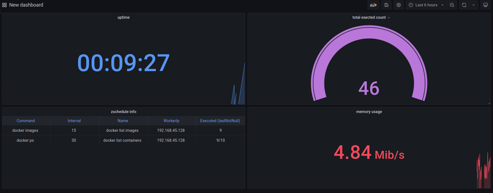

<div align="center">

[](https://go.dev/dl/) 
[](https://go.dev/dl/)
[](https://go.dev/dl/)
[](https://go.dev/dl/)
</div>

<div align="center">
 <br><br>
</div>

# ZSCHEDULE
this tool is about to do some stuff in a specefic interval, and it has three use cases : <br>
- API : run the api instance and use the scheduler throw the api. <br>
- CLI : run the cli instanse and use the scheduler throw the command line. <br>
- GO PACKAGE : you can use this scheduler in your go code throw download it from github.

## QUICK START
first of all you need to download this module throw this command :
```sh
git clone https://github.com/gopy-art/zschedule.git
```

then for run the CLI or API instance you can use this commands: 

- CLI :
```sh
sudo ./zschedule -t cli -c config.yaml --env zschedule.env --pr 0.0.0.0:4321
```

- API :
```sh
sudo ./zschedule -t api  --env ../zschedule.env --pr 0.0.0.0:4321
```

## FLAGS
```
  -c, --config string   set the path of the config file. (for example : /var/config/json)
      --env string      set the .env file path for api server configuration.
  -h, --help            help for zschedule
  -l, --logger string   set app logger type , stdout or file (default "stdout")
      --pr string       set the address of the prometheus. (0.0.0.0:1234)
  -t, --type string     set the type of the module. (api, cli)
  -v, --version         zschedule version
```

## ENV FILE 
```sh
LISTEN_ADDRESS=0.0.0.0:3030
DATABASE_ADDRESS=127.0.0.1
DATABASE_PORT=5432
DATABASE_USERNAME=username
DATABASE_PASSWORD=password
DATABASE_NAME=zschedule
CACHE_ADDRESS=redis://localhost:6379
```

## CONFIG FILE
if you run the cli instance you will need this file to specify your commands and configuration for be executed by module: 

```yaml
- NAME: "docker list containers"
  COMMAND: "docker ps"
  INTERVAL: 30
  LIMIT: 10       # infinite = -1 | or set a number
```